# TestHub 功能使用教程

本文档基于本地部署环境整理，覆盖当前项目里可见的主要功能模块、典型使用路径和钱包登录实战流程。

## 使用前准备

1. 打开前端：[http://localhost:3000](http://localhost:3000)
2. 确认后端接口可用：[http://127.0.0.1:8000/api/users/login/](http://127.0.0.1:8000/api/users/login/)
3. 演示登录请使用本地环境里已配置的管理员账号
4. 如需体验钱包登录，请先在本机 Chrome 中安装并登录 MetaMask。

---

## 1. 使用前准备

**功能定位：** 登录入口与基础检查

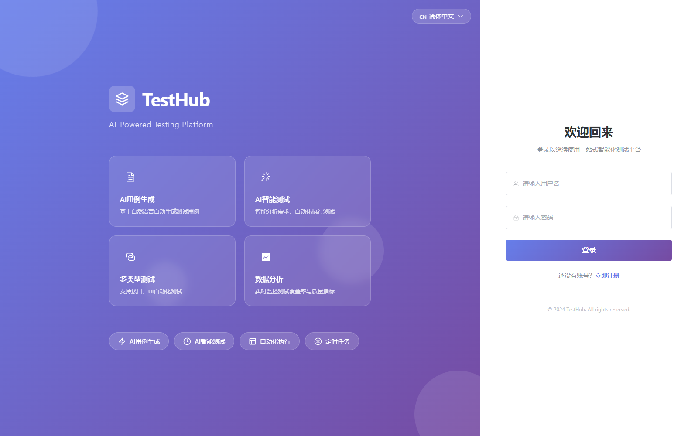

**推荐入口：**

- `/login`
- `/configuration/ai-model`
- `/configuration/ui-env`
- `/configuration/app-env`

**使用说明：**

1. 访问地址：前端 `http://localhost:3000`，首次进入先确认后端接口已可用。
1. 登录账号请使用你本地环境中已配置的管理员账号，登录成功后会进入首页。
1. 做 AI 用例生成前，建议先去配置中心补齐 AI 模型、Prompt 与生成策略。
1. 做 UI / AI / APP 自动化前，建议确认浏览器、设备、通知与环境配置。
1. 如果某页面是空状态，这是因为当前演示环境没有业务数据，不影响功能路径理解。

---

## 2. 首页与导航

**功能定位：** 从首页快速进入各功能域

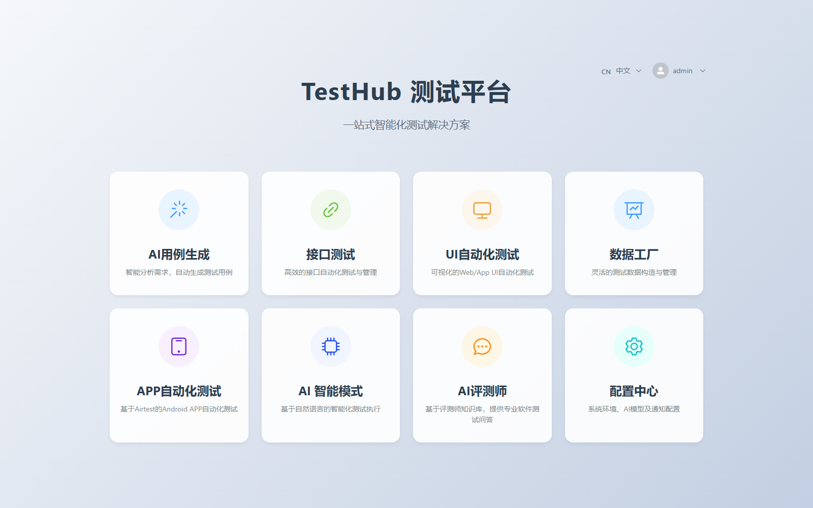

**推荐入口：**

- `/home`

**使用说明：**

1. 首页 8 张卡片对应平台的核心功能域：AI 用例生成、API 测试、UI 自动化、数据工厂、APP 自动化、AI 智能模式、AI 评测师、配置中心。
1. 常见使用顺序：先建项目，再准备资源（需求 / 接口 / 元素 / 用例），然后执行，最后看报告。
1. 多数业务页面会出现左侧菜单；同一模块内建议从上到下按“资源准备 -> 执行 -> 报告”顺序使用。
1. 右上角可以切换语言、查看当前登录用户和账户下拉菜单。
1. 遇到功能入口可点但页面提示未配置时，先回到配置中心完成前置项。

---

## 3. AI需求分析

**功能定位：** 把需求描述或文档转成测试用例任务

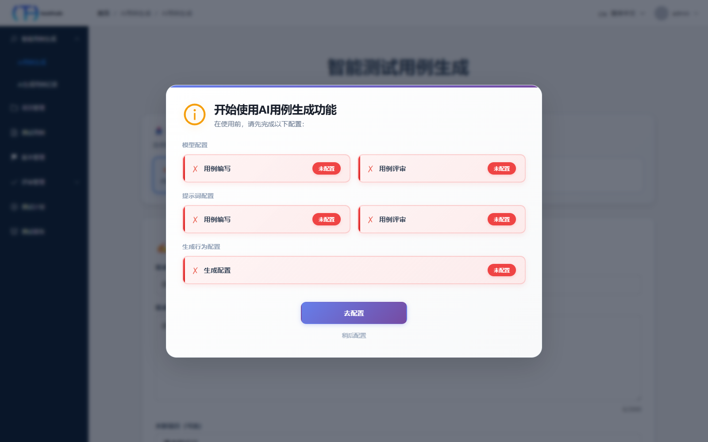

**推荐入口：**

- `/ai-generation/requirement-analysis`

**使用说明：**

1. 入口：`AI用例生成 -> AI用例生成`。
1. 支持两种输入：手工填写需求标题/描述，或上传 PDF、Word、TXT、Markdown 文档。
1. 输出模式可选“实时流式输出”或“完整输出”；前者更适合长文档，后者更适合短需求。
1. 如果首次进入弹出“开始使用 AI 用例生成功能”的检查框，点击“去配置”先补齐模型、提示词和生成策略。
1. 提交后会生成一个后台任务，后续到“AI 生成用例记录”页面追踪状态。

---

## 4. AI生成用例记录

**功能定位：** 查看 AI 任务状态与结果

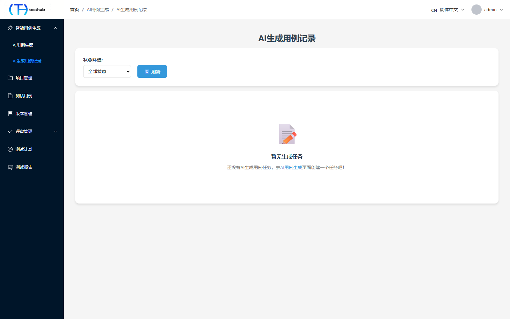

**推荐入口：**

- `/ai-generation/generated-testcases`
- `/ai-generation/task-detail/:taskId`

**使用说明：**

1. 入口：`AI用例生成 -> AI生成用例记录`。
1. 可按状态筛选任务：需求分析中、用例编写中、用例评审中、已完成、失败。
1. 点“刷新”获取最新状态，适合查看长时间运行的 AI 任务。
1. 已完成的任务可继续回流到项目、测试用例、评审和执行页面做人工整理。
1. 失败任务通常优先回查模型配置、Prompt 设置和原始需求内容是否完整。

---

## 5. 项目管理

**功能定位：** 统一承载需求、用例、版本与执行数据

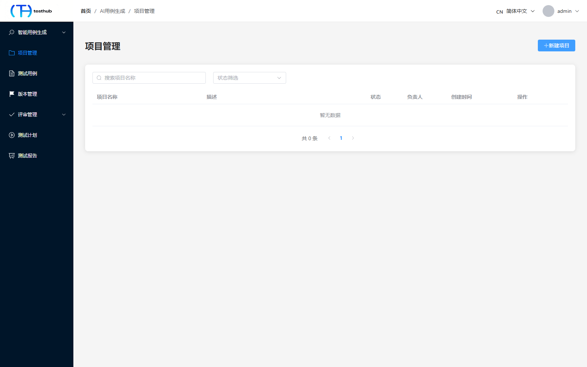

**推荐入口：**

- `/ai-generation/projects`

**使用说明：**

1. 入口：`AI用例生成 -> 项目管理`。
1. 点击“新建项目”创建测试项目，建议补齐项目名、描述、状态与负责人。
1. 项目是全平台的组织维度，后续版本、测试用例、评审和执行计划都尽量关联项目。
1. 列表页支持按状态筛选，适合区分在研、暂停、归档等项目。
1. 建议先建项目再导入需求或新建测试用例，避免后期大量数据补关联。

---

## 6. 测试用例管理

**功能定位：** 维护人工与 AI 生成的测试用例

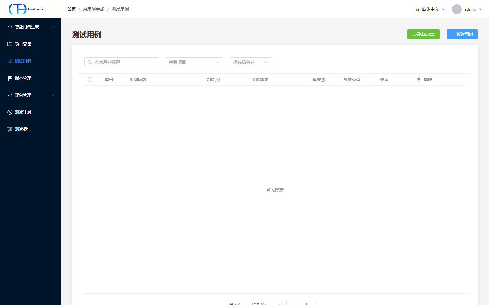

**推荐入口：**

- `/ai-generation/testcases`
- `/ai-generation/testcases/create`

**使用说明：**

1. 入口：`AI用例生成 -> 测试用例`。
1. 点击“新建用例”进入用例表单，可维护标题、项目、版本、优先级、类型和步骤。
1. 列表页支持项目筛选和优先级筛选，便于按范围整理用例。
1. 点“导出 Excel”可把当前用例数据导出给团队评审或离线归档。
1. AI 生成的用例建议先在这里做一次人工整理，再进入评审与执行阶段。

---

## 7. 版本管理

**功能定位：** 按版本归集测试范围

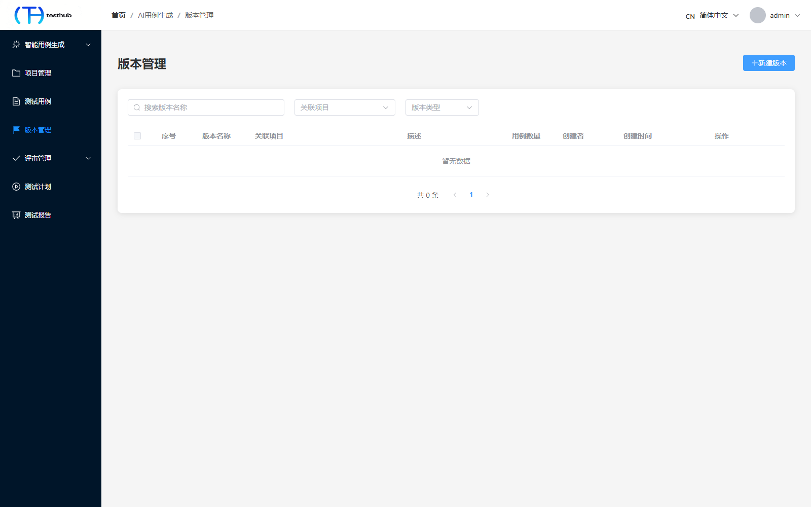

**推荐入口：**

- `/ai-generation/versions`

**使用说明：**

1. 入口：`AI用例生成 -> 版本管理`。
1. 点击“新建版本”创建版本并关联项目，用来沉淀每次发布的测试范围。
1. 版本可以挂接测试用例，便于后续统计某个版本对应的覆盖率与执行情况。
1. 建议把版本命名与实际发布节奏保持一致，例如 `v1.2.0`、`2026Q2`。
1. 如果项目长期维护，优先建立稳定的版本规范，再做批量用例归档。

---

## 8. 评审管理

**功能定位：** 组织测试用例评审流程

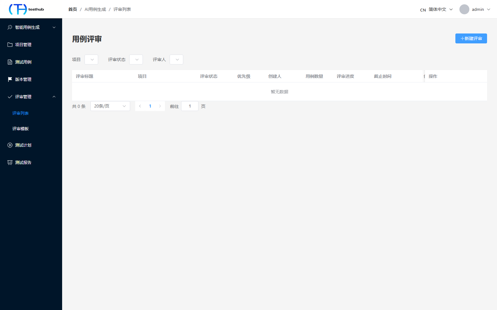

**推荐入口：**

- `/ai-generation/reviews`
- `/ai-generation/reviews/create`

**使用说明：**

1. 入口：`AI用例生成 -> 评审管理 -> 评审列表`。
1. 点击“新建评审”创建一次评审活动，可按项目、评审人、状态进行筛选。
1. 评审列表适合跟踪评审标题、优先级、用例数量、评审进度和截止时间。
1. 推荐在用例完成初稿后发起评审，避免执行阶段才发现结构性问题。
1. 如果团队多人协作，建议统一用项目 + 截止时间管理评审节奏。

---

## 9. 评审模板

**功能定位：** 沉淀可复用的评审规则

**推荐入口：**

- `/ai-generation/review-templates`

**使用说明：**

1. 入口：`AI用例生成 -> 评审管理 -> 评审模板`。
1. 点击“创建模板”建立标准化评审清单，例如字段完整性、步骤清晰度、边界覆盖等。
1. 模板适合在同一项目或同一业务线内反复复用，减少评审标准漂移。
1. 建议把常见驳回原因抽象成模板项，提升多轮评审效率。
1. 有了模板之后，再新建评审会更容易保持团队口径一致。

---

## 10. 测试计划

**功能定位：** 把用例组织成可执行计划

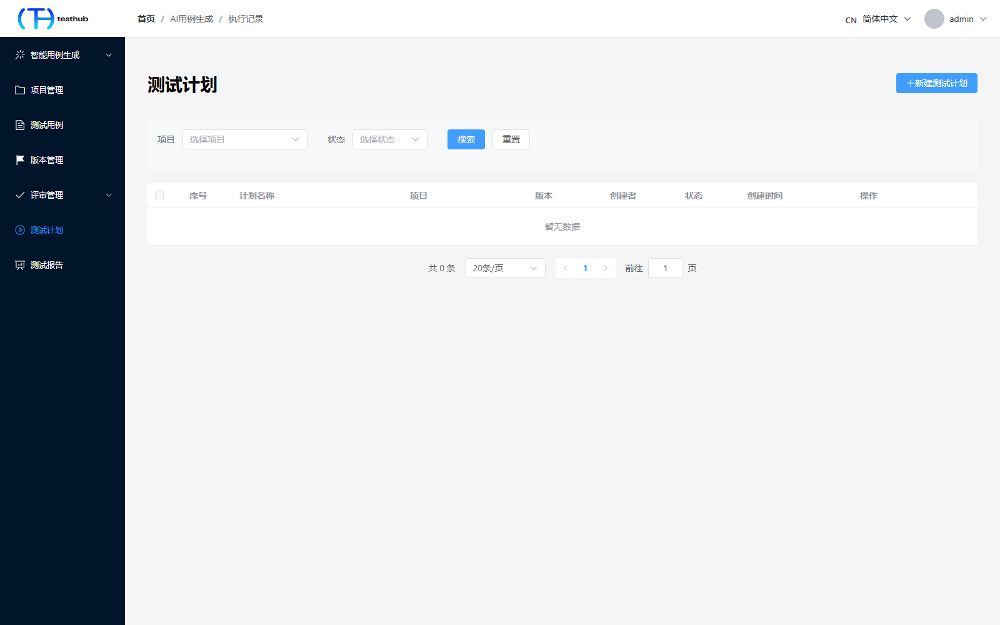

**推荐入口：**

- `/ai-generation/executions`

**使用说明：**

1. 入口：`AI用例生成 -> 测试计划`。
1. 点击“新建测试计划”建立一次执行任务，建议关联项目、版本和待执行用例集合。
1. 列表页支持项目和状态过滤，适合区分草稿、执行中、已完成等计划。
1. 测试计划是从“用例资产”到“执行结果”的关键桥梁，建议每次版本发版都创建独立计划。
1. 计划创建后，再进入执行与报告页追踪结果会更清晰。

---

## 11. AI测试报告

**功能定位：** 从计划结果回看覆盖率和趋势

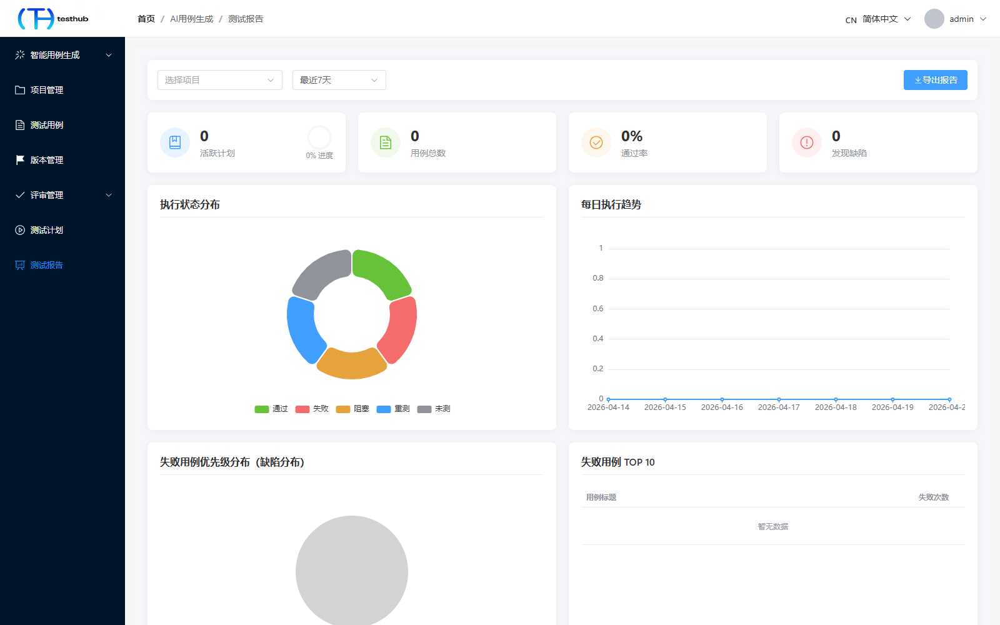

**推荐入口：**

- `/ai-generation/reports`

**使用说明：**

1. 入口：`AI用例生成 -> 测试报告`。
1. 报告页可按项目和时间范围查看活跃计划、用例总数、通过率、缺陷分布与趋势图。
1. 点击“导出报告”可输出当前统计结果，适合周报、版本复盘和项目汇报。
1. 如果某项目长期数据为空，通常说明计划尚未建立或未关联执行记录。
1. 建议把测试报告作为版本验收和回归结果复盘的最终落点。

---

## 12. API测试仪表盘

**功能定位：** 先看全局状态，再进入具体页面

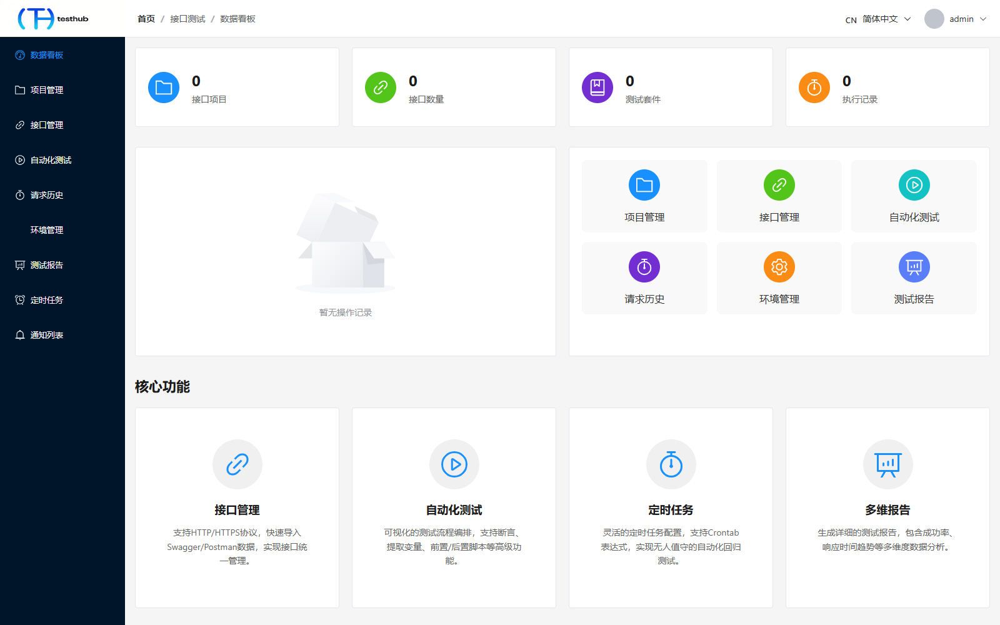

**推荐入口：**

- `/api-testing/dashboard`

**使用说明：**

1. 入口：`接口测试 -> 数据看板`。
1. 这里集中展示 API 项目数、接口数、测试套件数和执行记录数，适合作为模块总览。
1. 页面下半部会概括接口管理、自动化测试、定时任务和多维报告的能力定位。
1. 新用户建议先从看板认路，再依次进入项目管理、接口管理和自动化测试页面。
1. 如果要给团队演示接口模块，这一页最适合做首页介绍。

---

## 13. API项目管理

**功能定位：** 先建接口项目，再挂接口树

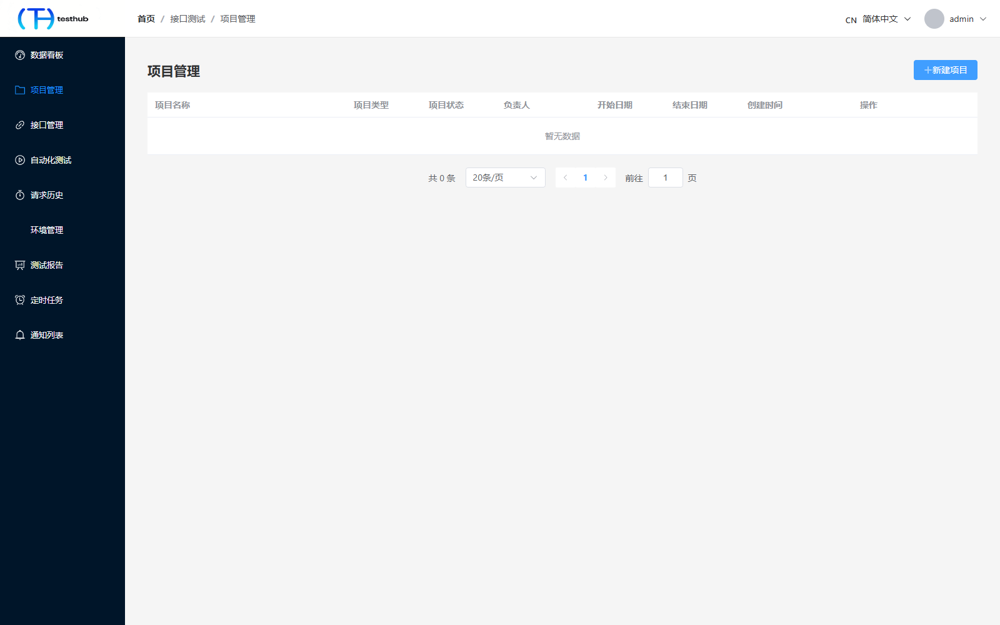

**推荐入口：**

- `/api-testing/projects`

**使用说明：**

1. 入口：`接口测试 -> 项目管理`。
1. 建议按系统、服务或产品线划分 API 项目，例如用户中心、支付中心、运营后台。
1. 接口项目是接口树、环境、自动化测试与报告的共同归属。
1. 创建项目后，再去“接口管理”里建分组和具体请求，会比后补归属更高效。
1. 如果接口很多，项目粒度不要过细，否则后期权限和统计会变碎。

---

## 14. 接口管理

**功能定位：** 维护请求定义、参数和断言基础

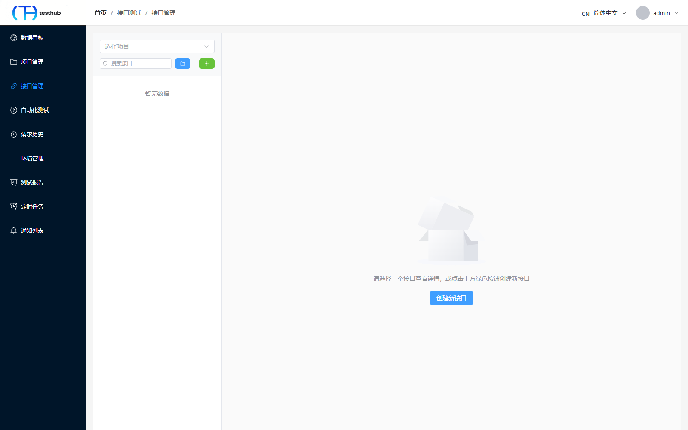

**推荐入口：**

- `/api-testing/interfaces`

**使用说明：**

1. 入口：`接口测试 -> 接口管理`。
1. 在这里维护接口树、请求方法、URL、请求头、参数、Body 与说明。
1. 建议先把常用登录、鉴权、核心业务接口整理出来，再逐步补充长尾接口。
1. 接口定义完善之后，自动化测试页才能更顺畅地复用这些接口。
1. 常见做法是按业务域建目录，再在目录下按接口粒度录入请求。

---

## 15. API自动化测试

**功能定位：** 把接口串成可执行场景

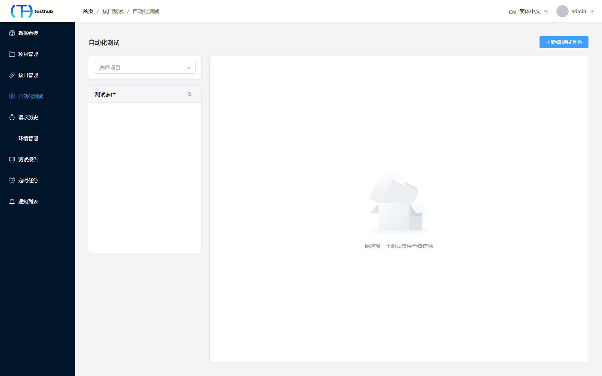

**推荐入口：**

- `/api-testing/automation`

**使用说明：**

1. 入口：`接口测试 -> 自动化测试`。
1. 这里适合把多个接口按顺序编排成测试场景，加入断言、变量提取和前后置步骤。
1. 推荐先在接口管理中维护好单接口，再在这里做跨接口串联和回归场景。
1. 做自动化时优先把登录、公共鉴权和关键业务链路拆成可复用步骤。
1. 编排完成后，结合环境管理和定时任务，就能形成稳定的回归流水线。

---

## 16. API环境、历史与定时任务

**功能定位：** 把单次调试变成可重复回归

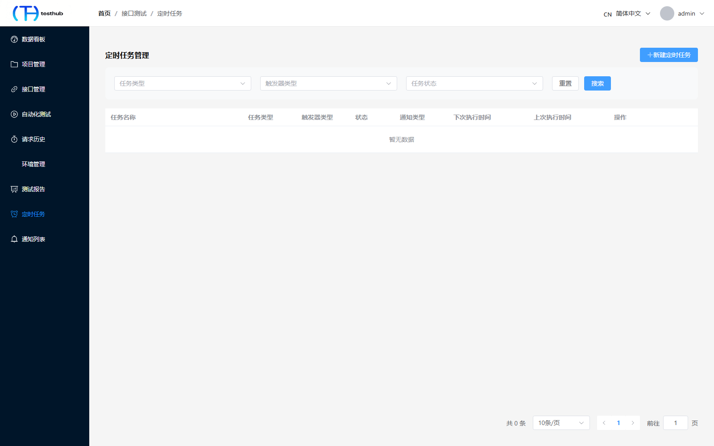

**推荐入口：**

- `/api-testing/environments`
- `/api-testing/history`
- `/api-testing/reports`
- `/api-testing/scheduled-tasks`
- `/api-testing/notification-logs`

**使用说明：**

1. 相关入口：`环境管理`、`请求历史`、`测试报告`、`定时任务`、`通知列表`。
1. 环境管理先配置 baseURL、变量、鉴权参数；请求历史用于排查单次调用细节。
1. 定时任务适合做每日巡检、冒烟回归和发布后守护；通知列表用于验证消息是否发出。
1. 报告页看成功率与趋势，历史页看单次失败原因，环境页保证不同环境可切换。
1. 推荐顺序：环境 -> 接口 -> 自动化 -> 定时任务 -> 报告 -> 通知复核。

---

## 17. UI自动化仪表盘

**功能定位：** 先看页面入口，再补资源

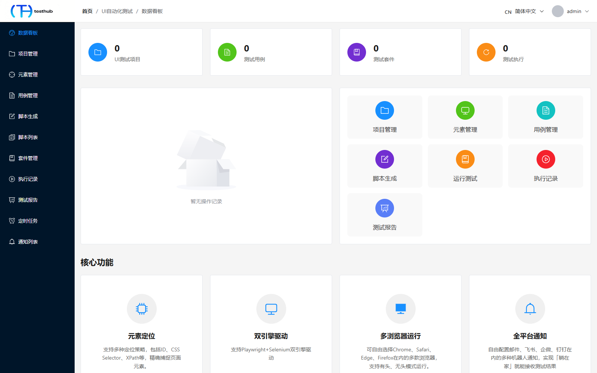

**推荐入口：**

- `/ui-automation/dashboard`

**使用说明：**

1. 入口：`UI自动化测试 -> 数据看板`。
1. 看板适合快速了解当前项目、元素、脚本、套件、执行记录和报告的整体入口。
1. 新建 UI 自动化前，推荐先准备项目与元素，再进入用例、脚本和执行链路。
1. 如果你的目标是录入已有脚本，直接跳脚本生成或脚本列表也可以。
1. 如果你的目标是从零搭平台，建议按“项目 -> 元素 -> 用例 -> 脚本 -> 套件 -> 执行”走。

---

## 18. UI项目与元素管理

**功能定位：** 先定义项目，再沉淀定位元素

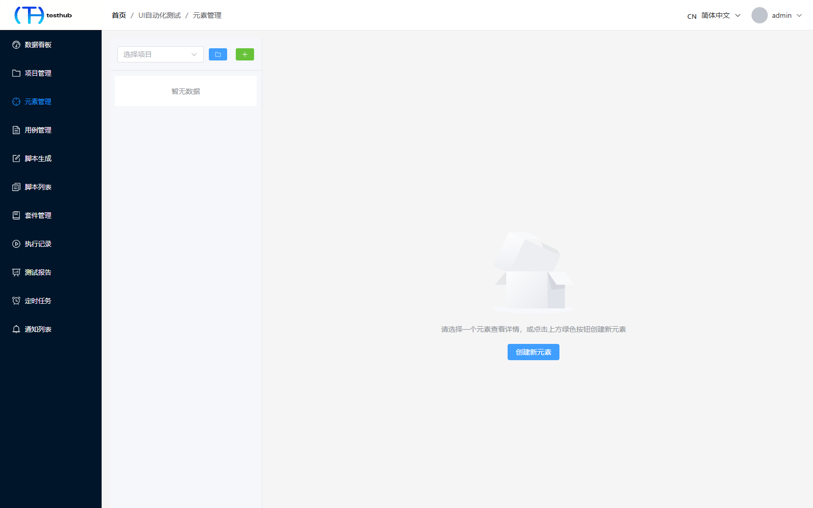

**推荐入口：**

- `/ui-automation/projects`
- `/ui-automation/elements-enhanced`

**使用说明：**

1. 相关入口：`项目管理` 与 `元素管理`。
1. 元素管理是 UI 自动化的基础资产，用来维护页面元素及其定位方式。
1. 元素库准备好之后，脚本生成页可以直接从左侧元素库插入定位代码。
1. 建议按页面或业务模块来组织元素，避免元素名混乱导致脚本难维护。
1. 项目页负责承载资源归属，元素页负责承载复用定位，这两页通常一起使用。

---

## 19. UI测试用例管理

**功能定位：** 把页面操作整理成可执行用例

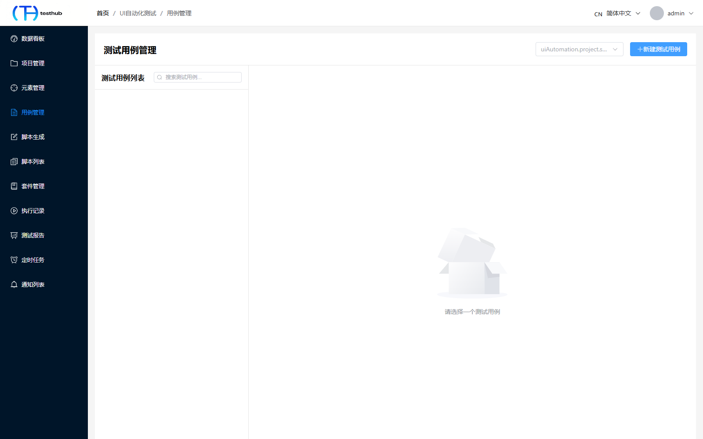

**推荐入口：**

- `/ui-automation/test-cases`

**使用说明：**

1. 入口：`UI自动化测试 -> 用例管理`。
1. 这里适合维护 UI 用例的标题、前置条件、步骤描述和业务归属。
1. 推荐先用人工语言描述清楚场景，再进入脚本生成页做自动化实现。
1. 如果一个页面流程很长，建议拆成多个小用例，再在套件里编排执行顺序。
1. 用例页的目标是沉淀“测试意图”，脚本页的目标是沉淀“自动化实现”。

---

## 20. UI脚本生成

**功能定位：** 从元素库快速拼装自动化脚本

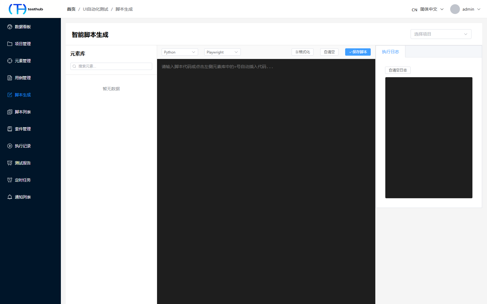

**推荐入口：**

- `/ui-automation/scripts-enhanced`
- `/ui-automation/scripts/editor`

**使用说明：**

1. 入口：`UI自动化测试 -> 脚本生成`。
1. 左侧是元素库，中间是脚本编辑区，右侧是执行日志；支持选择语言和执行引擎。
1. 推荐做法：先选项目，再从元素库插入关键元素，补足点击、输入、等待和断言逻辑。
1. 生成完成后点击“保存脚本”，再去脚本列表或套件页纳入统一执行。
1. 如果当前元素库为空，先回元素管理页建元素，再回来编排脚本。

---

## 21. UI脚本列表、套件与执行

**功能定位：** 把单脚本提升为稳定回归资产

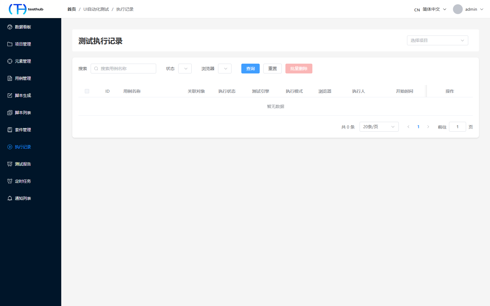

**推荐入口：**

- `/ui-automation/scripts`
- `/ui-automation/suites`
- `/ui-automation/executions`
- `/ui-automation/reports`
- `/ui-automation/scheduled-tasks`
- `/ui-automation/notification-logs`

**使用说明：**

1. 相关入口：`脚本列表`、`套件管理`、`执行记录`、`测试报告`、`定时任务`、`通知列表`。
1. 脚本列表适合管理单脚本版本；套件页适合把多个脚本按场景串起来执行。
1. 执行记录看单次结果，报告页看整体统计，定时任务负责把回归跑起来，通知页负责把结果送出去。
1. 推荐顺序：脚本保存 -> 组套件 -> 手工执行验证 -> 看报告 -> 上定时任务。
1. 如果要做 nightly 回归，这一组页面要一起配合使用。

---

## 22. AI智能模式

**功能定位：** 用自然语言直接驱动浏览器执行任务

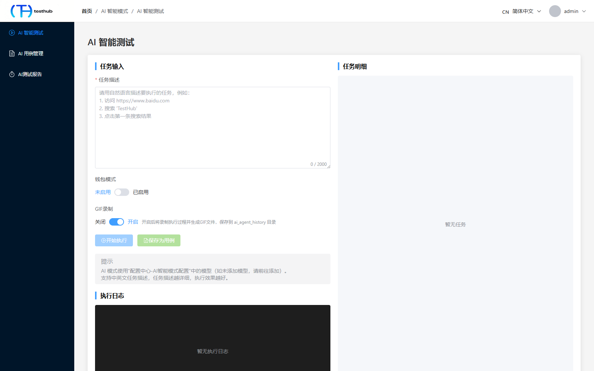

**推荐入口：**

- `/ai-intelligent-mode/testing`

**使用说明：**

1. 入口：`AI智能模式 -> AI智能测试`。
1. 适合没有现成脚本、但已经知道测试目标和操作步骤的场景。
1. 页面通常会要求输入任务描述、执行模式和相关参数，然后由 AI 自动规划执行路径。
1. 如果任务涉及钱包、登录、切链或签名，建议把关键步骤和限制条件写进任务文本里。
1. 首次使用前先到配置中心确认 AI 模型、浏览器环境和 AI 模式配置已经就绪。

---

## 23. AI智能用例与执行记录

**功能定位：** 看 AI 任务沉淀与执行结果

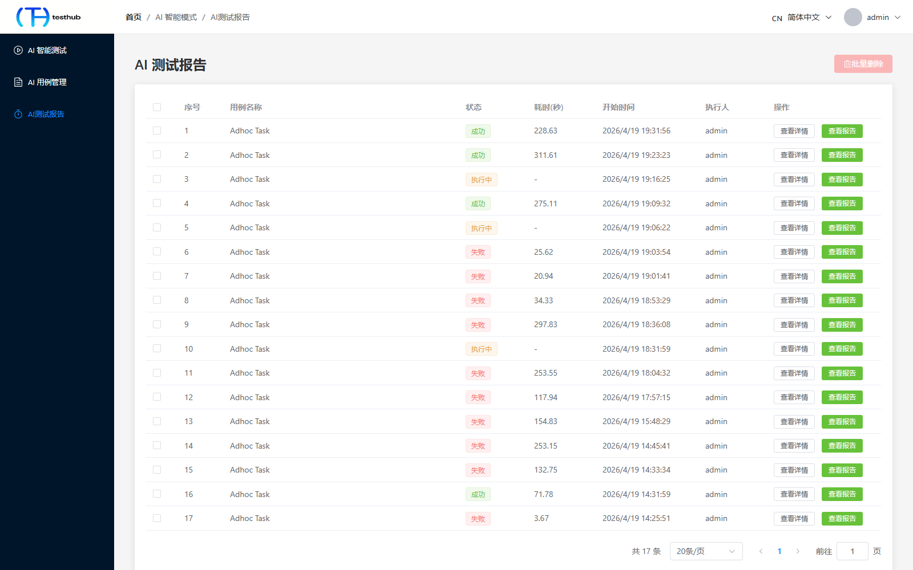

**推荐入口：**

- `/ai-intelligent-mode/cases`
- `/ai-intelligent-mode/execution-records`

**使用说明：**

1. 相关入口：`AI智能模式 -> AI用例管理` 与 `AI执行记录`。
1. 用例管理用于沉淀自然语言任务模板；执行记录用于回看每次运行的状态、日志和结果。
1. 如果一个自然语言任务已经验证可行，建议沉淀成固定用例，避免每次重写。
1. 执行记录页尤其适合排查 AI 步骤偏航、环境不稳定和登录失败问题。
1. 推荐顺序：先在测试页跑通 -> 再沉淀为 AI 用例 -> 再观察执行记录。

---

## 24. 钱包登录实战：连接钱包

**功能定位：** 以 SafuSkill 为例发起 MetaMask 登录

**推荐入口：**

- `外部站点：SafuSkill 钱包连接弹窗`

**使用说明：**

1. 站点页通常会先出现“Connect a Wallet”弹窗，左侧列出可选钱包。
1. 当前第一版建议优先使用 MetaMask 的 EVM 链流程，路径最稳定。
1. 在 AI 任务里要明确写出：连接钱包、切链、签名消息、发送交易确认等期望动作。
1. 如果站点先出现自定义“Connect Wallet”按钮，先点站点按钮，再等待钱包选择器出现。
1. 这一步的目标不是点任何随机钱包，而是精准切到 MetaMask 并进入授权链路。

---

## 25. 钱包登录实战：MetaMask 解锁与确认

**功能定位：** 完成扩展侧解锁、授权和确认

**推荐入口：**

- `MetaMask 扩展页`
- `钱包授权确认页`

**使用说明：**

1. 当 MetaMask 打开解锁页时，先输入钱包密码，再点击登录。
1. 如果后续出现连接、签名、切链或交易确认页，优先点击主确认按钮，不要盲点扩展内部元素。
1. 在当前项目里，AI 智能模式已经为钱包流程补了专门规则：解锁、确认、回站点。
1. 如果站点页空白或半加载，AI 会尝试切回前台标签页恢复，但你仍应在任务描述里写清目标地址。
1. 钱包弹窗处理完成后，再回到原站点验证是否已登录或地址是否已显示。

---

## 26. 钱包登录实战：登录结果

**功能定位：** 回到站点验证钱包已生效

**推荐入口：**

- `外部站点：SafuSkill 登录后首页`

**使用说明：**

1. 回站点后优先看右上角钱包地址、用户头像、已登录状态或权限入口是否出现。
1. 不要只看弹窗是否关闭，必须以站点状态变化作为最终验收依据。
1. 如果站点要求签名或补充授权，继续跟随站点流程完成最后一步。
1. 建议把“登录成功判定条件”写进 AI 任务描述，例如：右上角出现地址或进入个人首页。
1. 完成一次稳定流程后，可以把它沉淀到 AI 用例管理页作为可复用的钱包登录模板。

---

## 27. 数据工厂

**功能定位：** 集中准备测试数据和转换工具

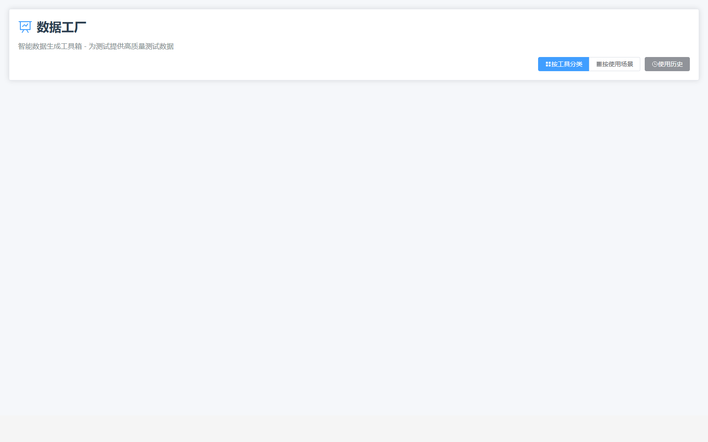

**推荐入口：**

- `/data-factory`

**使用说明：**

1. 入口：`数据工厂`。
1. 页面按“按工具分类”“按使用场景”“使用历史”组织，可承载数据生成、格式转换和加解密类工具。
1. 适合在做接口测试、UI 自动化、AI 任务时，统一准备手机号、邮箱、JSON、JWT、时间戳等数据。
1. 如果团队经常重复造测试数据，建议先把常用规则沉淀到这里，再在各模块中引用。
1. 这是全平台的共用底座，越早规范，后续自动化越省时间。

---

## 28. 配置中心：AI生成相关

**功能定位：** 模型、Prompt 与生成策略要先配好

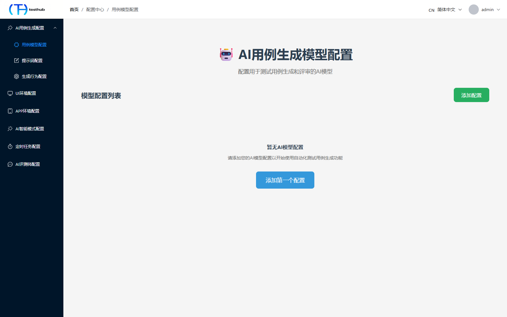

**推荐入口：**

- `/configuration/ai-model`
- `/configuration/prompt-config`
- `/configuration/generation-config`

**使用说明：**

1. 相关入口：`AI模型配置`、`Prompt配置`、`生成配置`。
1. AI 模型配置负责填 API Key、Base URL、模型名和角色；Prompt 配置负责定义编写与评审提示词。
1. 生成配置负责决定输出方式、自动评审等生成行为，是 AI 用例生成页的重要前置条件。
1. 如果 AI 用例生成页提示未配置，通常就是这三页至少有一项缺失。
1. 建议把生产、测试模型分开命名，并保留一套稳定模板做回退。

---

## 29. 配置中心：UI / APP 环境与 AI 模式

**功能定位：** 浏览器、设备和智能模式都从这里起步

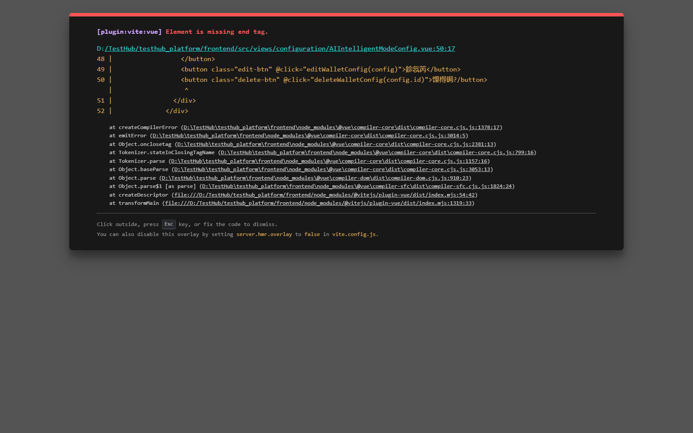

**推荐入口：**

- `/configuration/ui-env`
- `/configuration/app-env`
- `/configuration/ai-mode`
- `/configuration/scheduled-task`
- `/configuration/dify`

**使用说明：**

1. 相关入口：`UI环境配置`、`APP环境配置`、`AI模式配置`、`通知与任务配置`、`Dify配置`。
1. UI 环境页适合检查浏览器/驱动/自动化环境；APP 环境页适合检查设备与移动端执行配置。
1. AI 模式配置用来维护 Browser-use / 浏览器智能执行所需的模型与环境参数。
1. 通知与任务配置页用于统一消息通道；Dify 配置页用于接入外部 AI 助手能力。
1. 如果自动化跑不起来，不要先改脚本，先回配置中心排查环境和服务端配置。

---

## 30. APP自动化：总览与设备

**功能定位：** 先看 Dashboard，再确认设备可用

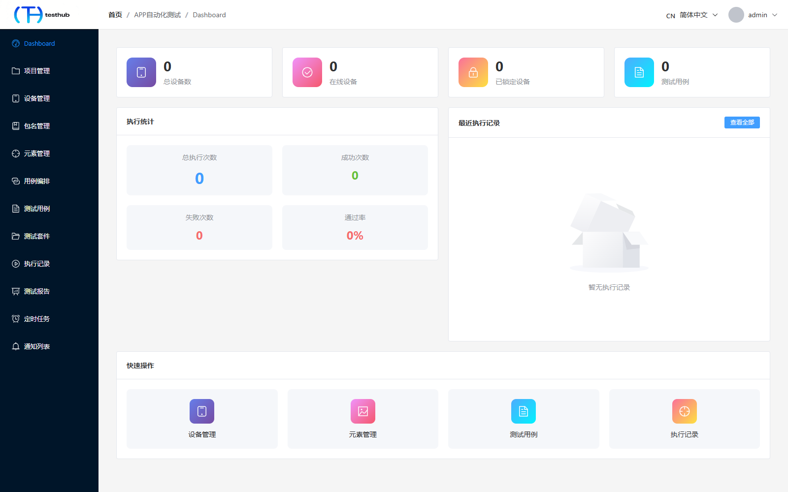

**推荐入口：**

- `/app-automation/dashboard`
- `/app-automation/devices`

**使用说明：**

1. 入口：`APP自动化测试 -> Dashboard`。
1. Dashboard 会展示项目、设备、用例、执行和最近记录，适合快速判断移动端资源是否就绪。
1. 真正开始执行前，优先进入“设备管理”确认模拟器或真机在线状态。
1. 如果没有设备，后续元素采集、场景编排和执行都会被阻断。
1. 建议把设备池和项目绑定关系先规划清楚，再开展 APP 自动化建设。

---

## 31. APP自动化：场景编排

**功能定位：** 把组件和步骤组合成可执行移动端流程

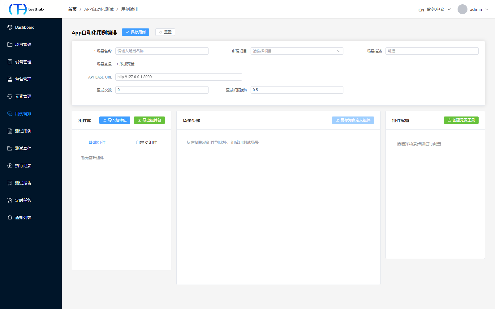

**推荐入口：**

- `/app-automation/scene-builder`
- `/app-automation/elements`

**使用说明：**

1. 入口：`APP自动化测试 -> 用例编排`。
1. 页面上方维护场景名称、所属项目、描述、重试次数等元数据；下方把组件拖入场景步骤区域完成编排。
1. 左侧组件库承载基础组件和自定义组件，中间是场景步骤，右侧是当前步骤配置。
1. 如果需要新元素，可直接点击右侧“创建元素工具”，说明移动端元素与场景是联动设计的。
1. 推荐做法：先建元素，再建基础组件，最后在这里拼装完整业务链路。

---

## 32. APP自动化：用例、套件、执行与报告

**功能定位：** 把单场景提升为可持续回归

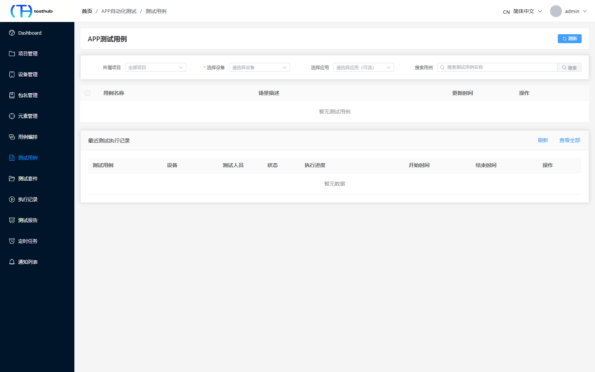

**推荐入口：**

- `/app-automation/test-cases`
- `/app-automation/test-suites`
- `/app-automation/executions`
- `/app-automation/reports`
- `/app-automation/scheduled-tasks`
- `/app-automation/notification-logs`

**使用说明：**

1. 相关入口：`测试用例`、`测试套件`、`执行记录`、`测试报告`、`定时任务`、`通知列表`。
1. 测试用例页沉淀单个场景，测试套件页把多个场景串成回归集合，执行记录页回看单次运行明细。
1. 报告页适合看最近执行结果和 Allure 入口，定时任务页负责把 APP 回归定时跑起来。
1. 建议先单用例跑通，再入套件，再上定时任务，最后用通知把结果发到团队。
1. 如果要做夜间巡检，这是 APP 自动化模块的最终落地链路。

---

## 33. 推荐落地流程

**功能定位：** 给新团队的最短上手路径

**推荐入口：**

- `/home`

**使用说明：**

1. 第 1 步：先完成配置中心里的 AI、浏览器、设备和通知配置。
1. 第 2 步：建立项目、版本和基础数据资产（接口、元素、测试数据）。
1. 第 3 步：根据业务场景选择 AI 用例生成、API 测试、UI 自动化或 APP 自动化开始沉淀资产。
1. 第 4 步：先手工跑通关键链路，再把它们纳入套件、报告和定时任务。
1. 第 5 步：把稳定的自然语言任务、钱包登录流程和高频回归用例沉淀成模板长期复用。

---
